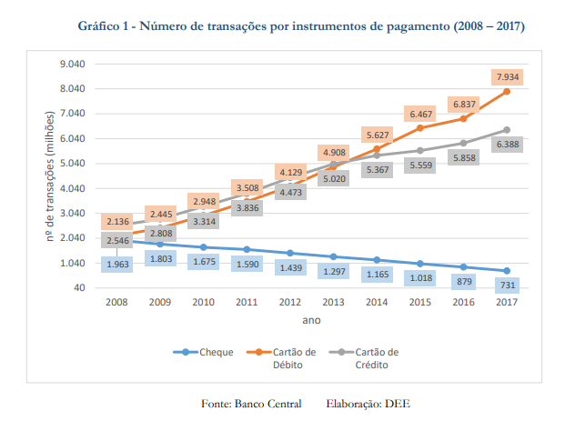
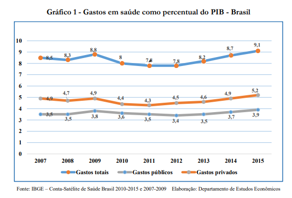
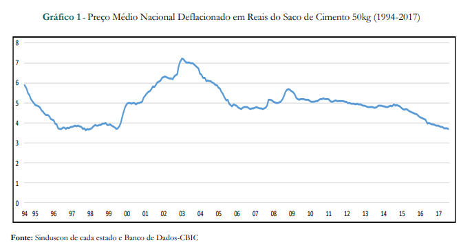
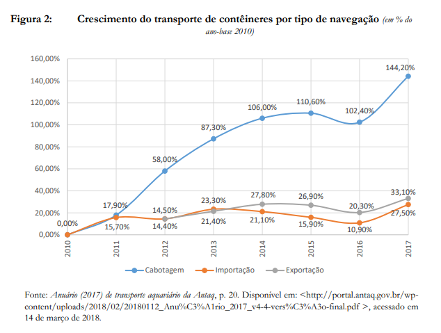
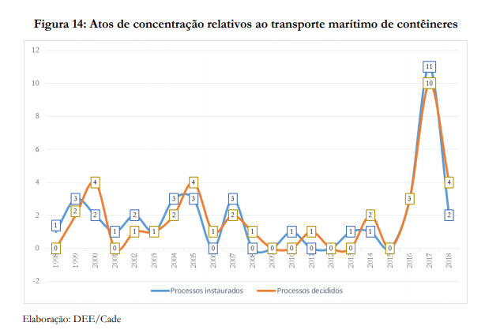
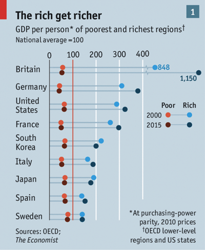
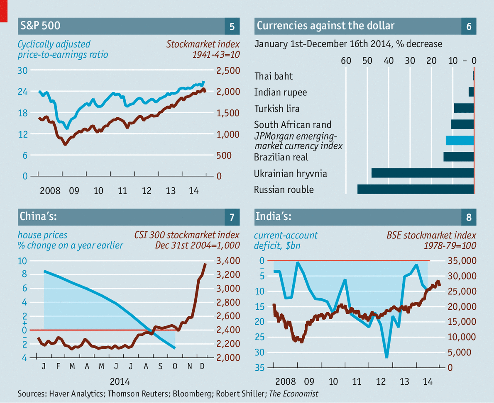

```{r, include=FALSE}
library(ggplot2)
library(ggthemes)
library(bbplot)
library(dplyr)
library(themedee)
library(gapminder)

brasil <- gapminder %>% 
  dplyr::filter(country == "Brazil") %>% 
  select(year, renda_per_capta = gdpPercap)
```


# Estrutura

1. O problema

1. Antecedentes

1. A proposta

---

# O Problema

Falta de padronização entre documentos

.pull-left[

Caderno de instrumentos de pagamento



]

.pull-right[

Caderno de planos de saúde



]

---

# O Problema

Falta de padronização entre documentos

.pull-left[

Caderno de instrumentos de pagamento


]

.pull-right[

Caderno de cimento



]

---

# O Problema

Falta de padronização no mesmo documento

.pull-left[

Caderno de contêiners




]

.pull-right[

Caderno de contêiners



]

---

# Antecedentes

Outra organizações já passaram pelo mesmo problema e 
decidiram resolvê-lo com adoção de padrões e princpícios 
para seus gráficos.

* BBC
* The Economist

---

# The Economist

Criação de padrões visuais / estéticos

.pull-left[



]

.pull-right[



]

---

# The Economist

.pull-left[

```{r}
(p <- ggplot(brasil, 
  aes(year, renda_per_capta)
  ) + geom_line(size = 1) )
```

]

.pull-right[

```{r}
p + theme_economist()
```

]

---

# BBC

Criou o pacote [`bbplot`](https://github.com/bbc/bbplot)


.pull-left[

```{r}
p
```

]

.pull-right[

```{r, warning=FALSE}
p + 
  bbc_style()
```

]

---

# Proposta

Pacote do DEE

Incluir tema e padrões do DEE com um ou dois comandos

---

# Proposta

.pull-left[

```{r}
p
```

]

.pull-right[

```{r, warning=FALSE}
p + 
  themedee:::theme_exemplo()
```

]

---

# Proposta

A proposta deve incluir uma opção para queles que não 
fazer o gráfico no R.

